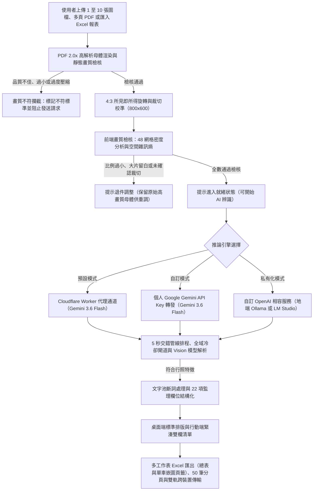

<div align="center">


# 🚗 台灣車輛行照 AI 智慧辨識助手 Auto-Licensify-AI-TW
### 支援多圖批次處理・48 網格前處理校準・5秒交錯管線推論・多工作表 Excel 結構化嵌圖・跨裝置雙軌傳輸

[](https://creativecommons.org/licenses/by-nc-sa/4.0/deed.zh-hant)
[](README.md)
[](https://deepmind.google/technologies/gemini/)
[](https://webrtc.org/)
[](https://github.com/exceljs/exceljs)
[](#-隱私與資安保證-zero-trust-security-architecture)

</div>

👉 **線上即用網址 (GitHub Pages)**：[https://hungprogo.github.io/Auto-Licensify-AI-TW/](https://hungprogo.github.io/Auto-Licensify-AI-TW/)  
💬 **問題回報與功能建議 (Issues)**：[https://github.com/hungprogo/Auto-Licensify-AI-TW/issues](https://github.com/hungprogo/Auto-Licensify-AI-TW/issues)

> 專為台灣車籍管理、公務車隊審查與租賃車商設計之專業行照辨識、跨裝置端對端傳輸與結構化 Excel 匯出系統。純前端靜態架構，無後端儲存資料庫，確保機敏車籍資料不落地。

---

## ⚠️ 平台預設通道使用限制與算力說明

> [!IMPORTANT]
> **在開始使用前，請先詳閱以下平台額度、速率限制與算力配置說明：**
> 1. **預設免費通道額度限制 (Free Tier)**：
>    - 本系統預設提供之免填 Key 通道為公益維護性質，後端串接 Google Gemini 官方免費層級 (Free Tier)。
>    - 受限於 Google 官方每分鐘請求數 (RPM) 與每日配額限制，系統在批次辨識時採用 **5 秒交錯管線排程 (Staggered Pipelining)**，平滑維持在 12 RPM 安全速率，避免觸發 429 速率超限錯誤。
> 2. **大量、高頻率或商業作業建議**：
>    - 若您有大量連續辨識、即時作業或穩定性需求，強烈建議於右上角【⚙️ 進階設定】中切換以下推論模式：
>      - **模式 A（個人 API 直連）**：填入個人 Google AI Studio API Key（享有專屬獨立配額與更高頻率上限）。
>      - **模式 B（本機離線私有化）**：切換為【自訂 OpenAI 相容服務】連接本機 **Ollama**（如 `llama3.2-vision:11b` / `llava`），無請求次數與頻率限制，且影像資料 100% 留存於本機內部網路。

---

## 🌟 專案簡介與架構流程

本專案適用於車籍資料登打、監理檢驗、物流運輸及車隊管理等業務情境，針對行照常見之**幾何底紋干擾、反光、模糊、拍攝傾斜、印章覆蓋及特種車輛複雜欄位**進行針對性最佳化，提供穩定、高結構化之車籍資料萃取功能。



---

## ✨ 核心功能規格 (Core Features)

### 1. 📊 多工作表 Excel 結構化匯出與實體照片嵌入 (Multi-Sheet Excel Suite with Image Embedding)
* **單車獨立頁籤與彙總總表設計**：
  * **工作表 1【車籍彙總總表】**：彙整批次中所有車輛的橫向 24 欄位清冊，便於資料庫批次匯入、數據統計與篩選。
  * **工作表 2~N+1【各車獨立專屬頁籤 (含實體照片)】**：為每台車建立獨立 Sheet（命名如 `1_ABC-1234`），左側採用結構化雙欄規格表排版，**右側 (D5 區域) 直接嵌入上傳之實體行照彩色高清照片（4:3 比例）**，真正實現圖文並茂一體化存檔！
* **Excel 報表資料雙向還原**：
  * 支援直接將本系統產出之標準 `.xlsx` 檔案拖入工作區，自動解析並還原車籍資料與實體照片，便於二次校對與後續轉發。

### 2. ⚡ 5 秒交錯管線排程與全體品質防呆把關 (Staggered Pipelining & Quality Check)
* **嚴格全體品質把關 (All-or-Nothing)**：若佇列中有任何 1 筆未完成裁切或被判定為畫質過低/過度壓縮，系統將整批攔截防呆，杜絕浪費 AI 配額。
* **5 秒交錯管線發送 (Staggered Pipelining)**：以每 5 秒為間隔平滑發送下一筆推論（維持 12 RPM 安全速率），10 張照片總耗時從 200 秒大幅縮短至約 65 秒（速度提升 3 倍以上）。
* **全域冷卻閘道廣播 (Global Cooldown Gateway)**：遇 429 速率限制或 503 伺服器高負載時，自動廣播暫停後續管線發送並倒數冷卻，結束後自動無縫恢復並重試失敗卡片。

### 3. 🔄 跨裝置雙軌加密傳輸系統 (Dual-Track P2P & HTTPS Transfer)
* **WebRTC P2P 直連傳輸**：手機端掃描接收端 QR Code 後建立端對端直接連線，資料傳輸不經第三方伺服器。
* **HTTPS 443 GSN 防火牆穿透備援**：於 GSN 內網或阻斷 UDP 封包之受保護網路環境中，系統具備 0.7 秒自適應探測機制，自動切換至 HTTPS 加密備援通道，確保傳輸穩定性。
* **6 位取件碼 + 純字串 QR 掃碼自動秒載 (E2EE)**：
  * **純字串 QR 條碼安全編碼**：QR Code 僅含純 6 位字串（不帶任何外部 URL，消除會話跳頁與外洩風險）。
  * **相機掃碼全自動下載還原**：接收端點擊【📷 開啟相機掃碼提取】，鏡頭一感應成功立即自動關閉鏡頭並秒速下載解密，零手動二次點擊！
  * **支援主動撤回銷毀**：傳送端支援【🗑️ 立即註銷】，一鍵從 Cloudflare 中繼物理銷毀；同時具備 24 小時自動過期與閱後即焚機制。

### 4. 🇹🇼 台灣 24 項監理法規標準化萃取管線
* **精準提取 24 項欄位**：包含車牌號碼、車輛種類、特殊車種、車身式樣、附加配備、排氣量、引擎號碼、車身號碼 (VIN)、出廠年月、載運人數 (座/立/駕駛室) 及載重量等。
* **日期雙向自動換算**：民國紀年（如 `112.05.20`）與西元標準格式（`2023-05-20`）雙向自動精準轉換。

### 5. ⚡ 50 筆大數據分頁渲染引擎與行動端自適應
* **DOM 負載控制**：超過 50 筆資料時自動啟動分頁控制器，維持 DOM 渲染流暢度；匯出報表時自動遍歷全量數據。
* **行動端手勢優化**：針對智慧型手機直式螢幕提供雙欄緊湊排版與觸控手勢（支援雙指縮放、拖曳平移）。

---

## 🏗️ 模組化積木式架構 (Modular Architecture)

本專案採「高內聚、低耦合、即插即用」的積木式架構設計，4 大通用核心可 100% 直接複製移植至任何新 AI 工具（如 YouTube 逐字稿轉錄、文件摘要等）：

```
Auto-Licensify-AI-TW/
├── js/
│   ├── core/                      # 4 大通用基礎核心（跨專案 100% 直接複製複用）
│   │   ├── ui-kit.js              # 🎨 全域 UI 套件 (3大主題切換/全域 Toast 通知/Popover/診斷面板)
│   │   ├── ai-dispatcher.js       # 🤖 AI 多通道調度器 (Worker 中繼/Gemini 直連/Ollama/交錯管線排程)
│   │   ├── dual-track-sync.js     # 📶 跨裝置雙軌同步器 (WebRTC P2P/Web Crypto AES-GCM/6位碼/相機掃碼/網路探測)
│   │   └── export-manager.js      # 📊 通用多格式匯出器 (ExcelJS 多頁籤嵌圖/SheetJS 備援/JSON 匯出/原生分享)
│   │
│   ├── plugins/                   # 2 大領域專屬插件（針對行照業務；新專案只需替換此處）
│   │   ├── cv-analyzer.js         # 🔍 影像前處理與畫質檢核 (48 網格密度分析/局部空間雜訊熵/清晰度檢驗)
│   │   └── license-normalizer.js  # 🧹 車籍資料清洗 (24 欄位字典矯正/式樣配備貪婪切分/民國西元換算)
│   │
│   └── app.js                     # 🚀 輕量應用控制器 (App Shell，純負責 DOM 事件與各模組串接)
│
├── css/style.css                  # 完整樣式表 (含大地紙感主題、實心藥丸操作列與純字串 QR 樣式)
├── docs/                          # 專案架構設計、實作計畫、任務清單與導覽文件 (雙軌同步維護)
├── worker.js                      # 後端 Cloudflare Worker 代理通道骨架 (含 /api/sync/revoke 路由)
└── index.html                     # 應用程式入口 (真預設 terracotta 大地紙感風格)
```


---

## 🧩 推論引擎與運算架構 (Inference Architecture)

本系統支援三種彈性推論模式，滿足開箱即用、專屬配額與地端私有化需求：

```text
                        ┌──➔ 【系統預設通道】──➔ Cloudflare 代理 (預設共享 Key) ──➔ Gemini 3.6 Flash (免費免填 Key)
                        │
【行照影像輸入】 ────────┼──➔ 【Gemini 自訂金鑰】──➔ Cloudflare 代理轉發 (帶入個人 Key 專屬配額) ──➔ Gemini 3.6 Flash
                        │
                        └──➔ 【OpenAI 相容服務】──➔ 本地純直連 Ollama / LM Studio (100% 地端離線)
```

| 運算模式 | 連線方式 | 適用情境與特性 |
| :--- | :--- | :--- |
| **1. 系統預設通道** | 前端 ➔ Cloudflare 邊緣代理 ➔ Google Gemini API | 免填 API Key，開箱即用；內建 5 秒交錯速率平滑控制。 |
| **2. Gemini 自訂金鑰** | 前端 ➔ Cloudflare 代理轉發 (帶入個人 `x-gemini-api-key`) ➔ Google Gemini API | 填入個人 Gemini API Key，透過 Worker 封裝標準 Prompt 並享有個人獨立配額。 |
| **3. 本地私有化 (OpenAI 相容)** | 前端 ➔ 本地 `http://localhost:11434/v1` (純直連) | 連接本機 **Ollama (`llama3.2-vision:11b` / `llava`)** 或 **LM Studio**，影像 100% 留存地端內部網路。 |

---

## ⚠️ 本機自建與網路環境配置說明 (Network & Environment Notes)

若您自建或將本專案部署於內部網路運行，請留意以下環境特徵與配置：

### 1. 🌐 跨網域存取與 CORS 來源白名單 (Origin Policy)
* **現象**：在手機端以本機伺服器（如 `http://10.x.x.x` 或 `http://192.168.x.x`）開啟時，點擊辨識若回傳 `Failed to fetch`，代表請求來源遭 Cloudflare Worker 後端白名單攔截。
* **解法**：
  1. **切換本地離線模式**：點擊網頁右上角 **「⚙️ 進階設定」**，推論引擎切換為 **【自訂 OpenAI 相容服務】** 並連線至本機 Ollama，純前端直接請求地端端點，不受 Cloudflare CORS 限制。
  2. **修改 Worker 白名單**：若使用自建 Worker，請在 [`worker.js`](worker.js) 的 `ALLOWED_ORIGINS` 清單中加入您的本機 IP 網段。


### 2. 📡 跨裝置掃碼直傳之網路自適應機制
* **一般網路環境 (如家用寬頻、行動網路)**：發送端與接收端同時在線時，系統優先透過 WebRTC DataChannel 建立端對端隧道直傳，傳輸過程不經中繼伺服器。
* **機關與企業受保護網路 (如 GSN / 嚴格防火牆)**：若底層探測到 UDP 傳輸遭防火牆阻斷，系統將自動啟動標準 HTTPS 443 端對端加密備援通道，傳輸需時約 15~60 秒；使用者亦可隨時切換至【6 位取件碼】模式進行提取。

### 3. 💾 6 位取件碼之非同步離線存取
* 針對發送端與接收端非同時在線場景，發送端於本機完成 AES-256 加密後上傳暫存並取得 6 位取件碼。接收端在時限內隨時輸入代碼即可解密提取，取件完成後雲端暫存自動物理銷毀（閱後即焚）。

---

## 🚀 部署指南 (Deployment Guide)

### 前端部署 (GitHub Pages)
1. Fork 本倉庫至您的 GitHub 帳號。
2. 進入 Repository ➔ **Settings** ➔ **Pages**。
3. 在 **Build and deployment** 下選擇 **Branch: `main`**，資料夾選擇 **`/(root)`** 並點擊 **Save**。
4. 稍候數分鐘即可透過專屬網址存取！

### 後端 Cloudflare Worker 代理通道與跨裝置 KV 部署指南
本專案隨附標準開源 `worker.js`，包含模型呼叫骨架、來源白名單驗證與跨裝置 E2EE 中繼路由：

#### 步驟 1：建立 Worker 並填入代碼
1. 註冊並登入 [Cloudflare Dashboard](https://dash.cloudflare.com/) ➔ 點擊左側 **Compute (Workers & Pages)**。
2. 建立新 Worker，將本專案根目錄的 [`worker.js`](worker.js) 內容完整複製並貼入編輯器，點擊 **Save and Deploy**。

#### 步驟 2：設定 Gemini API Key 環境變數
1. 進入 Worker 的 **Settings** ➔ **Variables and Secrets**。
2. 新增變數 `GEMINI_API_KEY`：填入您的 Google Gemini API Key（建議勾選 Encrypt 加密儲存）。

#### 步驟 3：綁定跨裝置即時同步 KV 儲存庫 (重要配置 ⭐)
> **💡 為什麼建議綁定 KV？**
> Cloudflare Worker 採用分散式邊緣架構。手機（行動網路）與電腦（家用寬頻）連線可能被導向不同邊緣節點。**綁定 KV 儲存庫**可讓各節點共享中繼通道，確保跨裝置資料即時同步與取件後銷毀。

1. **建立 KV Namespace**：
   - 點擊 Cloudflare 左側選單 **Storage & databases** ➔ **Workers KV**。
   - 點擊 **Create Instance**（或 Create a namespace）。
   - **Namespace name** 填入：`SYNC_KV` ➔ 點擊 **Create**。
2. **將 KV 綁定至 Worker**：
   - 回到 **Workers & Pages** ➔ 點進您的 Worker。
   - 點擊上方 **Bindings** 標籤頁 ➔ 點擊右上角 **Add binding +**。
   - 彈出視窗左側選擇 **KV namespace** ➔ 點擊右下角藍色 **Add Binding** 按鈕。
   - **Name (變數名稱)**：務必填入 **`SYNC_KV`**（全大寫，與程式碼對應）。
   - **Value (KV namespace)**：下拉選單選取剛才建立的 **`SYNC_KV`**。
   - 點擊 **Save and Deploy** 即可完成！

---

## 🔒 隱私與資安保證 (Zero-Trust Security Architecture)

* **零金鑰外洩承諾**：前端程式碼與 Git Repository 絕不包含任何明文 API Key，全面由 Cloudflare Worker 後台環境變數注入。
* **100% 記憶體即時運算**：本系統不設立任何後端資料庫，所有車籍影像與文字資料僅存在於瀏覽器記憶體中，關閉分頁即刻徹底銷毀。
* **來源網域嚴格全等白名單 (Zero-Trust Origin Guard)**：Worker 後端採用 `new URL().origin` 嚴格全等比對，杜絕偽造子網域或爬蟲無 Header 盜連。
* **單一 IP 速率限制與 8MB 體積防護**：單一 IP 每分鐘限制請求頻率，並對超過 8MB 之異常 Payload 實施硬性攔截，徹底保護後端計算資源。
* **模型白名單安全鎖定 (Anti-Abuse Guard)**：後端強制鎖定官方輕量 Flash 免費層級模型（`gemini-3.6-flash`），任何試圖傳入高額計費 Pro/Ultra 模型之請求一律強制降級為預設。
* **端對端加密與閱後即焚**：跨裝置取件碼傳輸全採客戶端 AES-256 E2EE 加密，雲端中繼站無從獲取明文，取件完成後即刻物理銷毀。

---

## 🌐 開源架構與官方服務邊界宣告 (Scope & Boundaries)

本專案恪守開源透明原則，明確劃分基礎建設與專有服務範圍如下：

### 🟢 100% 完整開源之基礎建設 (Open Source)
* **前端全套工程架構**：雙軌傳輸系統、前端 CV 48 網格分析、多工作表 Excel 產出與照片嵌入、50 筆分頁渲染引擎、5 秒交錯管線排程器。
* **後端 Cloudflare Worker 代理骨架**：來源白名單防護、IP 頻率限制、6 位取件碼 KV 暫存與閱後即焚模組。

### 🔒 本專案雲端平台專有保留 (Proprietary & Cloud-Only)
* **台灣監理深度 Prompt 與字詞校準字典**：本線上平台所搭載，設置於 Cloudflare Worker 端的 AI 模型專屬提示詞與 Schema 結構，用於精準識別並校準行照中各欄位內容正確性，及自動分流混合於車身式樣及附加配備欄位中的相關資料，屬專有知識資產，不包含於開源代碼 worker.js 中。
* **自建者需知**：開源之 `worker.js` 與前端提供完整之通訊與傳輸骨架；自行部署 Worker 或連接本地模型之使用者，**請依自身業務需求自行撰寫與注入適當的 System Prompt 提示詞與 Schema 結構**。

---

## ❓ 常見問題與資安解答 (FAQ & Security Deep-Dive)

<details>
<summary><b>Q1：在【進階設定】填入個人 Gemini API Key，金鑰會不會有被公網側錄或被伺服器留存的風險？</b></summary>
<br>

* **公網傳輸安全 (100% 防側錄)**：
  前端至 Cloudflare Worker 以及 Worker 至 Google 官方 API 之間，全程強制採用 **HTTPS (TLS 1.3 / 256-bit AES-GCM 銀行級加密)**。在公網、Wi-Fi、電信業者 (ISP) 或中間路由器節點，任何第三方封包擷取工具（如 Wireshark）皆無法解密 HTTP Header 與通訊內容，完全無側錄風險。
* **伺服器端零留存承諾 (Zero-Retention)**：
  Cloudflare Worker 採用**無狀態記憶體運算 (Stateless In-Memory Processing)**，您的個人 API Key 僅在記憶體中作單次即時轉發，請求完成後記憶體瞬間釋放，系統**不設任何後端資料庫儲存金鑰，亦不記錄任何 Key 日誌**（開源之 `worker.js` 代碼完全公開透明可供檢驗）。
* **為什麼個人 Key 依然建議經由 Worker 代理？**
  若前端純直連 Google，將無法載入後端專屬的 **24 項監理法規深度 System Instruction、特種車輛校準字典與 Gatekeeper 守門員審查**，導致辨識精準度大幅崩壞。透過 Worker 轉發，您既能享有**個人專屬的獨立 API 配額 (不再受公用通道頻率擠壓)**，又能獲得 **100% 滿血精準度的專業辨識品質**！

</details>

<details>
<summary><b>Q2：為什麼使用官方預設通道的辨識品質，與純自建通道或通用 LLM 相比，精準度落差巨大？</b></summary>
<br>

* **官方通道頂級精準度的核心關鍵**：
  官方 Cloudflare Worker 後端並非單純的 API 轉發器，而是搭載了歷經海量實體樣張校準的 **「台灣車輛監理法規專屬深度 System Instruction 與規則庫」**：
  1. **24 項法規標準化映射**：精準萃取台灣特有車身式樣、附加配備與特殊車種。
  2. **印章與筆跡抗噪矯正**：針對檢驗印章遮蔽、防偽幾何底紋干擾、反光及手寫字樣進行針對性文字池斷詞與字元校驗。
  3. **民國/西元自動雙向精算**：自動解析監理所發照與換補照日期（如 `111.07.02`）並雙向換算標準西元格式。
  4. **第一階段 Gatekeeper 嚴格守門員**：前置審查文件真偽與單一性，防止非行照或多圖混雜導致的亂數解析。
* **為什麼自建端點或通用開源模型容易出現大量欄位缺失？**
  一般通用 Vision 模型（或未注入監理專用提示詞的自建端點）僅具備基礎文字識別能力，缺乏對台灣監理制度與特殊排版的深度理解，面對複雜的特種公務車、印章覆蓋或手寫欄位時，極易產生大量空格（`-`）、車牌錯字或格式錯亂。
* **改善建議**：
  - **推薦採用【系統預設通道 + 個人 Gemini Key】模式**：在【⚙️ 進階設定】填入個人免費申請之 Google Gemini API Key，系統會自動在傳輸時由 Worker 注入官方滿血的 24 項監理法規 Prompt，**既能享有最高規格的頂級辨識精準度，又能擁有個人專屬的獨立配額與不受擠壓的請求頻率**！
  - 若採【OpenAI 相容地端私有化模式】，建議於【⚙️ 進階設定】的「自訂 System Prompt」欄位中，自行為您的地端模型填入專屬的 Prompt 指示詞與 JSON 結構定義。

</details>

<details>
<summary><b>Q3：為什麼使用「系統預設通道」辨識時，有時候需要等超過一分鐘、甚至跳出「觸發頻率保護，啟動全域冷卻」提示？如何改善？</b></summary>
<br>

* **發生原因剖析**：
  1. **公共免費配額頻寬擠壓**：系統預設通道提供免填 Key 開箱即用，底層串接 Google Gemini 官方免費層級 (Free Tier)，全網訪客**共享每分鐘 15 次請求 (15 RPM) 的公共配額**。若恰逢多位訪客同時批次辨識，容易暫時觸發 Google 頻率限制 (429 Rate Limit)。
  2. **Google 伺服器尖峰高負載 (High Demand)**：特定尖峰時段 Google 官方伺服器負載較高（回傳 503 或 High Demand），回應延遲會顯著上升。
  3. **系統智慧保護機制**：為避免辨識失敗，本系統內建「指數退避與全域排程冷卻器」，會自動暫停 6~20 秒後依序自動重試（最多 3 次），確保最終依然能產出正確結果，但總耗時因此延長至 1 分鐘以上。
* **徹底改善的最佳解決方案 (推薦 ⭐)**：
  * 🌟 **【推薦】填入個人免費申請之 Gemini API Key**：
    前往 [Google AI Studio](https://aistudio.google.com/) 免費取得專屬 API Key（完全免費），並於本系統【⚙️ 進階設定】中填入。
    ➔ **預期效益**：您將**獨享個人專屬的 15 RPM 獨立頻寬**，不再與全網訪客爭搶額度，告別冷卻等待；同時依然享有官方 Worker 注入的 100% 滿血 24 欄位監理 Prompt！
  * **【臨時因應】**：若暫不打算申請 Key，建議稍候 30 秒至 1 分鐘待公共冷卻窗口釋放後再點擊辨識。

</details>

<details>
<summary><b>Q4：為什麼批次辨識時採用「5 秒交錯發送」，而不是 10 張照片一口氣同時併發？</b></summary>
<br>

* Google Gemini 官方免費層級 (Free Tier) 具備嚴格的 **每分鐘請求數 (15 RPM) 速率上限**。
* 若瞬間同時併發 10 張照片，將瞬間衝撞 API 頻率限制，導致後續請求全數拋出 `429 Rate Limit Exceeded` 失敗。
* 本系統研發之 **5 秒交錯管線排程 (Staggered Pipelining)**，將發送頻率平滑控制在 12 RPM 安全區間，在確保 100% 零 429 報錯的前提下，將 10 張照片的總處理耗時從傳統序列式的 200 秒大幅縮短至約 65 秒（速度提升 3 倍以上）！

</details>

<details>
<summary><b>Q5：為什麼上傳照片後，系統提示「偵測到畫面包含大面積非行照或多餘空白」並被攔截退件？</b></summary>
<br>

* 這是系統內建的 **CV 空間網格分析與 Gatekeeper 守門員保護機制**。
* 為確保 24 項細微欄位（如 4 碼車身號碼、引擎號碼與換補照日期）達到最高精準度，影像中行照本體的**可視畫面佔比必須 ≧ 60%**。
* **因應方式**：請點擊該卡片上的【🔍 放大 / 🔄 旋轉】按鈕，利用滑鼠滾輪放大行照填滿 4:3 畫面，微調位置後點擊【✂️ 確認裁切】即可解除攔截並開始辨識。

</details>

<details>
<summary><b>Q6：若機關或企業有極端資安合規要求，金鑰與影像完全不可接觸任何第三方雲端，該如何配置？</b></summary>
<br>

系統原生提供兩種【100% 絕對私有化】解決方案：
1. **方案 A（自建 Cloudflare Worker）**：
   依據本手冊指引，將開源之 `worker.js` 部署至貴單位自身的 Cloudflare 企業帳號中，並在前端【⚙️ 進階設定】中填入貴單位的 Worker 網址。金鑰與傳輸通道 100% 由貴單位自主掌控。
2. **方案 B（地端完全離線私有化）**：
   在前端【⚙️ 進階設定】切換為【OpenAI 相容服務】，連接本地運行的 **Ollama**（如 `llama3.2-vision:11b`）或 **LM Studio**。電腦可**完全拔除網路線斷網運行**，影像與車籍數據 100% 留存於本機內部。

</details>

<details>
<summary><b>Q7：跨裝置 6 位取件碼與純字串 QR 掃碼是如何保護車籍隱私的？</b></summary>
<br>

* **純字串 QR 安全編碼**：傳送端生成的 QR Code 僅編碼純 6 位字元（絕不包含任何 HTTP 網址），外部相機掃描不會外洩連線或跳頁，所有操作均在系統頁面內閉環完成。
* **端對端加密 (E2EE)**：資料在手機端送出前，即透過 **Web Crypto AES-256-GCM** 於客戶端本機完成密碼編譯，金鑰由 6 位取件碼動態衍生。
* **雲端僅存密文**：Cloudflare 中繼節點僅持有無法破解的密文二進位字串，無法窺探任何車籍明文或照片。
* **閱後即焚與主動銷毀**：接收端提取解密後，中繼資料庫即刻執行**物理刪除 (Physical Purge)**；傳送端亦隨時可點擊【🗑️ 立即註銷】主動銷毀；若逾 24 小時未提取，雲端 TTL 機制亦會自動永久銷毀。

</details>

<details>
<summary><b>Q8：匯出的 Excel 報表如何處理實體照片？是否支援將報表重新拖回系統？</b></summary>
<br>

* **二進位嵌入技術**：本系統採用原生二進位流將 4:3 高畫質行照照片直接寫入 `.xlsx` 檔案內部（位於每台車專屬工作表的 D5 儲存格），**不依賴任何外部圖床網址**，即使斷網或離線傳遞檔案，照片永遠不丟失。
* **雙向還原解析**：支援將本系統產出的 `.xlsx` 檔案直接拖入網頁工作區，系統能自動逆向還原所有車籍欄位與實體照片，方便隨時二次校對與跨裝置轉發。

</details>

---

## 📜 第三方開源套件致謝與授權宣告 (Third-Party Notices)

本專案前端所使用之開源函式庫皆為寬鬆非傳染性授權（MIT / Apache 2.0），與本系統專屬業務代碼具有明確邊界：

| 函式庫名稱 | 授權協議 | 本系統用途 |
| :--- | :---: | :--- |
| **PeerJS** | **MIT** | WebRTC 點對點連線基礎通訊封裝 |
| **Html5-QRCode** | **Apache 2.0** | 網頁端相機調用與 QR Code 影像解析 |
| **QRCode.js** | **MIT** | 配對 QR Code 向量圖案生成 |
| **ExcelJS** | **MIT** | Excel 多工作表建立與二進位圖片嵌入 |
| **SheetJS (xlsx)** | **Apache 2.0** | 基礎試算表匯出備援 |
| **Crypto-JS** | **MIT** | 客戶端 AES-256-GCM 資料加密 |
| **PDF.js** | **Apache 2.0** | PDF 檔案解析與 2.0x 高解析母體渲染 |

---

## 📄 授權條款 (License & Dual Licensing)

本專案採用 **雙軌授權模式 (Dual Licensing)**：

1. **非商業用途 (Non-Commercial)**：
   * 遵循 [Creative Commons Attribution-NonCommercial-ShareAlike 4.0 International (CC BY-NC-SA 4.0)](https://creativecommons.org/licenses/by-nc-sa/4.0/deed.zh-hant) 授權。
   * 個人、教育、學術研究與公務非營利單位得在保留作者姓名標示之前提下免費使用、研究與修改。
2. **商業營利與企業整合用途 (Commercial Use)**：
   * 任何商業公司、營利實體、收費服務整合或商業營運使用，均排除於開源條款之外。
   * 商業授權諮詢：`hungpro@gmail.com`

---
*版本：v1.5 (Official Release) ｜ 專案維護：hungprogo*
